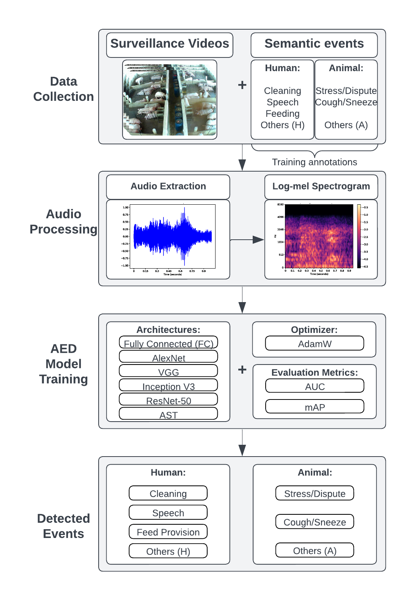

# Deep Learning Solutions for Audio Event Detection in a Swine Barn Using Environmental Audio and Weak Labels

- [Deep Learning Solutions for Audio Event Detection in a Swine Barn Using Environmental Audio and Weak Labels](#deep-learning-solutions-for-audio-event-detection-in-a-swine-barn-using-environmental-audio-and-weak-labels)
  - [Introduction](#introduction)
  - [Citing](#citing)
  - [Dataset](#dataset)
  - [Dependencies/Environment](#dependenciesenvironment)
  - [Usage](#usage)
  - [Contact](#contact)

## Introduction

<p align="center"></p>

This repository contains the official code implementation for the paper "Deep Learning Solutions for Audio Event Detection in a Swine Barn Using Environmental Audio and Weak Labels" by André Moreira Souza, Elaine Parros Machado de Sousa, Livia Lissa Kobayashi, Lucas Andrietta Tassoni, Cesar Augusto Pospissil Garbossa, and Ricardo Vieira Ventura. The paper was accepted by the Applied Intelligence journal.

In this paper, we evaluated deep learning methods for AED on a novel audio dataset from a swine farming environment. To the extent of our knowledge, this is the first study that integrates animal, human, and environmental sounds for AED and auditing purposes. As such, the main contributions of this work are:

- An evaluation of computer vision and attention-based methods for the AED task with a novel dataset.
- Extensive experiments to evaluate the impact of different ML techniques on AED on the proposed dataset.

[Back to top](#deep-learning-solutions-for-audio-event-detection-in-a-swine-barn-using-environmental-audio-and-weak-labels)

## Citing

If you find this repository useful for your research, please consider citing our paper (accepted):

<!-- TODO: Update Citing BibTeX reference-->
```latex
@article{souza2025aed,
  title={Deep Learning Solutions for Audio Event Detection in a Swine Barn Using Environmental Audio and Weak Labels},
  author={Souza, Andr{\'e} Moreira and Sousa, Elaine Parros Machado de and Kobayashi, Livia Lissa and Tassoni, Lucas Andrietta and Garbossa, Cesar Augusto Pospissil and Ventura, Ricardo Vieira},
  journal={Applied Intelligence},
  year={2025},
  publisher={Springer}
}
```

[Back to top](#deep-learning-solutions-for-audio-event-detection-in-a-swine-barn-using-environmental-audio-and-weak-labels)

## Dataset

We perfomed all our experiments on the [aSwine](https://github.com/andremsouza/aswine) dataset, which is a novel audio dataset collected from a swine barn. Further details about the dataset can be found in the paper, and in its respective repository.

[Back to top](#deep-learning-solutions-for-audio-event-detection-in-a-swine-barn-using-environmental-audio-and-weak-labels)

## Dependencies/Environment

The code was implemented using Python 3.11.7 and PyTorch 2.1.0. The dependencies are listed in the `requirements.txt` file. You can install them using the following command:

```bash
pip install -r requirements.txt
```

[Back to top](#deep-learning-solutions-for-audio-event-detection-in-a-swine-barn-using-environmental-audio-and-weak-labels)

## Usage

Each experiment is contained in its own Python file, and the code is organized in a modular way. The main scripts are:

- `alexnet.py`: AlexNet model implementation and experiments.
- `fully_connected.py`: Fully connected model implementation and experiments.
- `inception_v3.py`: InceptionV3 model implementation and experiments.
- `plast.py`: AST model implementation and experiments. For AST usage, there are additional dependencies. Please refer to the [AST repository](https://github.com/YuanGongND/ast/).
- `resnet.py`: ResNet model implementation and experiments.
- `vgg.py`: VGG model implementation and experiments.

We utilized argparse to parse the command line arguments. For example, you can run the AlexNet experiments using the following command:

```bash
python alexnet.py --annotations_file="annotations.csv" --data_dir="data/audio/" --num_classes=7
```

To see the full list of arguments, you can use the `--help` flag:

```bash
python alexnet.py --help
```

You can also use the implemented PyTorch Lightning architecture classes for downstream tasks by importing them in your own scripts. For example, you can use the `InceptionV3` class to train an Inception V3 model on your own dataset.

```python
from inception_v3 import InceptionV3

# ...
model = InceptionV3(num_classes=7, dropout=0.5)
trainer = pl.Trainer()
trainer.fit(model, train_dataloader, val_dataloader)
# ...
```

For reproducibility and convenience, we store default hyperparameters in a `config.py` file. You can modify the hyperparameters in this file to suit your needs.

[Back to top](#deep-learning-solutions-for-audio-event-detection-in-a-swine-barn-using-environmental-audio-and-weak-labels)

## Contact

If you have any questions, please bring up an issue or send me an email at [andre.moreira.souza@usp.br](mailto:andre.moreira.souza@usp.br).

[Back to top](#deep-learning-solutions-for-audio-event-detection-in-a-swine-barn-using-environmental-audio-and-weak-labels)
